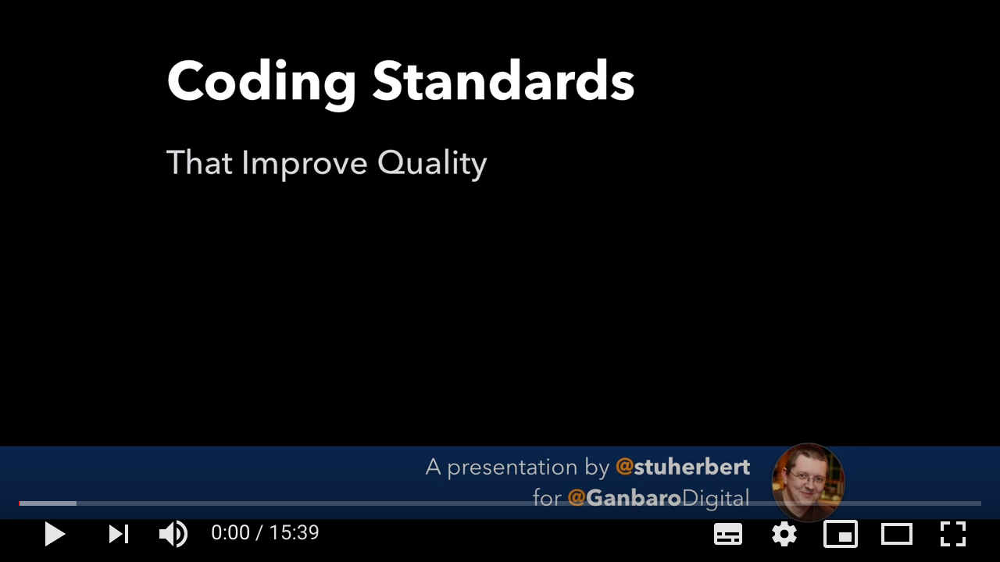

# Coding Standards

This repo holds the coding standards for any Typescript project managed by the SafelyTyped community.

Feel free to adopt them for your own community too :)

## Introduction

### Why Do We Need Coding Standards At All?

_Written coding standards_ are designed to _ensure an acceptable level of consistent software quality_ across our projects.

That's doing a lot of heavy lifting. Let's break it down.

* The whole point of the _SafelyTyped_ projects is to give you tools to raise the quality of your software.
* To achieve that, we believe it's important that all of our code is written, tested and documented to (at least!) the same standard.
* We don't believe that it's possible to achieve consistency unless that standard itself has been documented in a way that's easy to understand.

Even in an office environment - where people can quickly and easily discuss things face-to-face - they are helpful. On a distributed project - where discussions don't happen in real-time, and where contributors can be infrequent - they are essential.

### Where Do These Standards Come From?

They're based on the approach that Stuart has developed and refined over the last 25 years of working on software quality and assurance.

Watch this video to see Stuart talking about this approach:

## The Standards

See [STANDARDS.md](STANDARDS.md) for the all-in-one-document list.