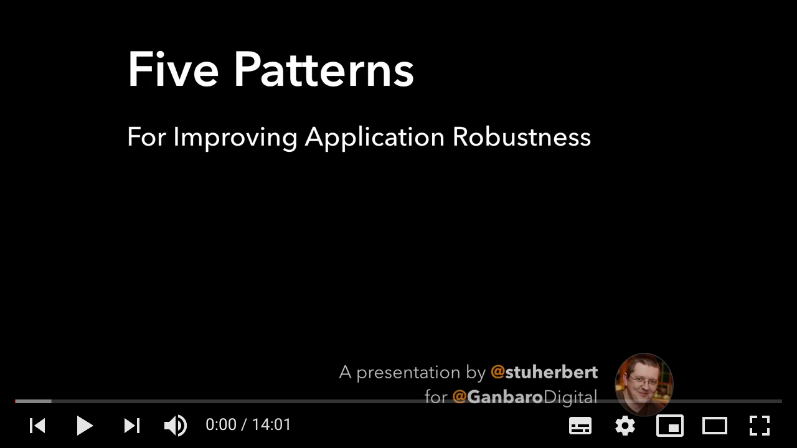
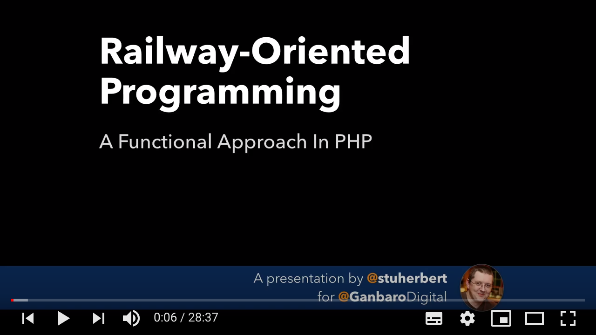

# 1.2.1 - Support OnError Handlers

Priority | ID | Category | Criteria | Impacts
---------|----|----------|----------|--------
Key | [1.2.1][1.2.1] | Errors | Every function that has error conditions must accept an `OnError` handler. | [Adoption][ADOPTION], [Robustness][ROBUSTNESS]

Table of Contents:
- [Description](#description)
- [Discussion](#discussion)
  - [When Things Go Wrong, Delegate!](#when-things-go-wrong-delegate)
  - [Why Exceptions?](#why-exceptions)
- [Further Reading](#further-reading)

## Description

Every function that has error conditions must accept an `OnError` handler.

The `OnError` handler is a [user-supplied optional dependency][User-Supplied Optional Dependencies]. It accepts `AnyAppError` as the input, and by default it throws that input.

## Discussion

### When Things Go Wrong, Delegate!

What should happen when an error occurs? What should your code do?

Those kinds of decisions are called _policy decisions_. In software architectural terms, software libraries do not implement _policy_. _Policy_ is set by the [caller][Caller], and should ultimately come from the application and its business logic.

The `OnError` handler is our way of allowing the [caller][Caller] to pass in _policy_. And we have the `THROW_THE_ERROR` default handler for when the [caller][Caller] doesn't want to.

### Why Exceptions?

In functional-style programming - and in languages like Golang which do not support exceptions at all - errors aren't thrown: they are passed back to the [caller][Caller] as a return value.

The problem with that is that we simply cannot rely on developers to check return values for errors. Human beings are not machines, and they rarely do anything with 100% accuracy and consistency.

Exceptions force the call stack to unwind. Exceptions prevent an error condition from propagating further. If the [caller][Caller] ignores them, it doesn't matter: the call stack just continues to unwind.

Return values are for data.

## Further Reading

For more information, here are two videos of Stuart talking about error handling. They're part of (much longer!) videos looking at problems around creating robust applications.

[ADOPTION]: ../../impacted-areas/ADOPTION.md
[CONTRIBUTIONS]: ../../impacted-areas/CONTRIBUTIONS.md
[CORRECTNESS]: ../../impacted-areas/CORRECTNESS.md
[GOVERNANCE]: ../../impacted-areas/GOVERNANCE.md
[PROJECT-MAINTENANCE]: ../../impacted-areas/PROJECT-MAINTENANCE.md
[ROBUSTNESS]: ../../impacted-areas/ROBUSTNESS.md
[SECURITY]: ../../impacted-areas/SECURITY.md
[TESTABILITY]: ../../impacted-areas/TESTABILITY.md
[Base Class]: ../../glossary/base-class.md
[Branded Type]: ../../glossary/branded-type.md
[Caller]: ../../glossary/caller.md
[CQRS]: ../../glossary/CQRS.md
[Data Bag]: ../../glossary/data-bag.md
[Data Guarantee]: ../../glossary/data-guarantee.md
[Data Guard]: ../../glossary/data-guard.md
[Default Value]: ../../glossary/default-value.md
[Defensive Programming]: ../../glossary/defensive-programming.md
[Dependency]: ../../glossary/dependency.md
[Dependency Injection]: ../../glossary/dependency-injection.md
[Docblock]: ../../glossary/docblock.md
[End-User]: ../../glossary/end-user.md
[Entity]: ../../glossary/entity.md
[Exported Item]: ../../glossary/exported-item.md
[Extension]: ../../glossary/extension.md
[Flavoured Type]: ../../glossary/flavoured-type.md
[Function Prefix]: ../../glossary/function-prefix.md
[Function Signature]: ../../glossary/function-signature.md
[Hard-Coded]: ../../glossary/hard-coded.md
[Identity]: ../../glossary/identity.md
[Identity Function]: ../../glossary/identity-function.md
[Identity Type]: ../../glossary/identity-type.md
[Immutability]: ../../glossary/immutability.md
[Inherited Method]: ../../glossary/inherited-method.md
[Instantiable Type]: ../../glossary/instantiable-type.md
[Mandatory Dependency]: ../../glossary/mandatory-dependency.md
[No-Op]: ../../glossary/no-op.md
[Nominal Typing]: ../../glossary/nominal-typing.md
[Optional Input]: ../../glossary/optional-input.md
[Overridden Method]: ../../glossary/overridden-method.md
[Plain Object]: ../../glossary/plain-object.md
[Primitive Type]: ../../glossary/primitive-type.md
[Protocol]: ../../glossary/protocol.md
[Refined Type]: ../../glossary/refined-type.md
[Rest Parameter]: ../../glossary/rest-parameter.md
[Reusability]: ../../glossary/reusability.md
[Side Effects]: ../../glossary/side-effects.md
[Smart Constructor]: ../../glossary/smart-constructor.md
[Structural Typing]: ../../glossary/structural-typing.md
[Type Alias]: ../../glossary/type-alias.md
[Type Casting]: ../../glossary/type-casting.md
[Type Guarantee]: ../../glossary/type-guarantee.md
[Type Guard]: ../../glossary/type-guard.md
[Type Inference]: ../../glossary/type-inference.md
[Type Predicate]: ../../glossary/type-predicate.md
[User-Supplied Functional Options]: ../../glossary/user-supplied-functional-options.md
[User-Supplied Input]: ../../glossary/user-supplied-input.md
[User-Supplied Options]: ../../glossary/user-supplied-options.md
[User-Supplied Optional Dependencies]: ../../glossary/user-supplied-optional-dependencies.md
[Value]: ../../glossary/value.md
[Value Object]: ../../glossary/value-object.md
[1.2.1]: ./1.2.1.md