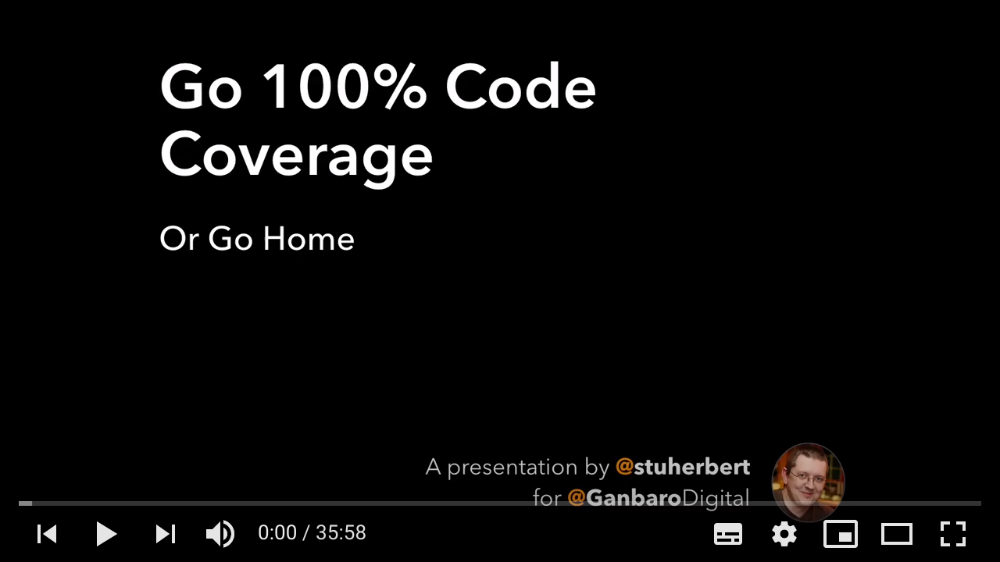

# 1.5.1 - 100% Code Coverage

Priority | ID | Category | Criteria | Impacts
---------|----|----------|----------|--------
Key | [1.5.1][1.5.1] | Unit Tests | All code must have 100% code coverage. | [Adoption][ADOPTION], [Contributions][CONTRIBUTIONS], [Correctness][CORRECTNESS], [Project Maintenance][PROJECT-MAINTENANCE], [Robustness][ROBUSTNESS]

Table of Contents:
- [Description](#description)
- [Discussion](#discussion)
  - [Why 100% Code Coverage?](#why-100-code-coverage)
  - [I'm Struggling To Reach 100% Code Coverage](#im-struggling-to-reach-100-code-coverage)
  - [Help! My Code Relies On External Services](#help-my-code-relies-on-external-services)
  - [Further Reading](#further-reading)

## Description

All code must have 100% code coverage.

* 100% line coverage
* 100% branch coverage

We use [`nyc`](https://istanbul.js.org/) for our code coverage metrics.

## Discussion

### Why 100% Code Coverage?

It's the reason why we call them _safe types_. They're _safe_ because they deliver guarantees about the data that each type holds. And we know they're safe because they're well-tested.

### I'm Struggling To Reach 100% Code Coverage

If you've got code that seems unreachable, you probably need to add in a [mandatory dependency][Mandatory Dependency].

Unreachable code normally exists to handle rare (or possibly even future) error conditions.

For example, if you use a regex that includes _named groups_, you can't access any of the _named groups_ until you've convinced the Typescript compiler that the groups are there.

That's an `if` statement that will work 100% of the time, but without it, your code will not compile. How do you test that?

The way to test that is to make the regex a [mandatory dependency][Mandatory Dependency], and then wrap the whole thing in an arrow function. That way, your unit test can pass in a different regex to trigger the error condition, and there's no risk of production code using the wrong regex.

### Help! My Code Relies On External Services

If you've writing tests for code that relies on a database, API, or anything at all that's outside the codebase, there's a couple of options available:

1. Use a different third-party library, one that supports _interceptors_ or other mechanisms to help you with unit testing.
2. Pass in a _mock_ as a [mandatory dependency][Mandatory Dependency].

Only resort to _mocks_ when there's no other way to achieve 100% code coverage.

### Further Reading

Here's a video of Stuart talking about why 100% Code Coverage matters:

[ADOPTION]: ../../impacted-areas/ADOPTION.md
[CONTRIBUTIONS]: ../../impacted-areas/CONTRIBUTIONS.md
[CORRECTNESS]: ../../impacted-areas/CORRECTNESS.md
[GOVERNANCE]: ../../impacted-areas/GOVERNANCE.md
[PROJECT-MAINTENANCE]: ../../impacted-areas/PROJECT-MAINTENANCE.md
[ROBUSTNESS]: ../../impacted-areas/ROBUSTNESS.md
[SECURITY]: ../../impacted-areas/SECURITY.md
[TESTABILITY]: ../../impacted-areas/TESTABILITY.md
[Base Class]: ../../glossary/base-class.md
[Branded Type]: ../../glossary/branded-type.md
[Caller]: ../../glossary/caller.md
[CQRS]: ../../glossary/CQRS.md
[Data Bag]: ../../glossary/data-bag.md
[Data Guarantee]: ../../glossary/data-guarantee.md
[Data Guard]: ../../glossary/data-guard.md
[Default Value]: ../../glossary/default-value.md
[Defensive Programming]: ../../glossary/defensive-programming.md
[Dependency]: ../../glossary/dependency.md
[Dependency Injection]: ../../glossary/dependency-injection.md
[Docblock]: ../../glossary/docblock.md
[End-User]: ../../glossary/end-user.md
[Entity]: ../../glossary/entity.md
[Exported Item]: ../../glossary/exported-item.md
[Extension]: ../../glossary/extension.md
[Flavoured Type]: ../../glossary/flavoured-type.md
[Function Prefix]: ../../glossary/function-prefix.md
[Function Signature]: ../../glossary/function-signature.md
[Hard-Coded]: ../../glossary/hard-coded.md
[Identity]: ../../glossary/identity.md
[Identity Function]: ../../glossary/identity-function.md
[Identity Type]: ../../glossary/identity-type.md
[Immutability]: ../../glossary/immutability.md
[Inherited Method]: ../../glossary/inherited-method.md
[Instantiable Type]: ../../glossary/instantiable-type.md
[Mandatory Dependency]: ../../glossary/mandatory-dependency.md
[No-Op]: ../../glossary/no-op.md
[Nominal Typing]: ../../glossary/nominal-typing.md
[Optional Input]: ../../glossary/optional-input.md
[Overridden Method]: ../../glossary/overridden-method.md
[Plain Object]: ../../glossary/plain-object.md
[Primitive Type]: ../../glossary/primitive-type.md
[Protocol]: ../../glossary/protocol.md
[Refined Type]: ../../glossary/refined-type.md
[Rest Parameter]: ../../glossary/rest-parameter.md
[Reusability]: ../../glossary/reusability.md
[Side Effects]: ../../glossary/side-effects.md
[Smart Constructor]: ../../glossary/smart-constructor.md
[Structural Typing]: ../../glossary/structural-typing.md
[Type Alias]: ../../glossary/type-alias.md
[Type Casting]: ../../glossary/type-casting.md
[Type Guarantee]: ../../glossary/type-guarantee.md
[Type Guard]: ../../glossary/type-guard.md
[Type Inference]: ../../glossary/type-inference.md
[Type Predicate]: ../../glossary/type-predicate.md
[User-Supplied Functional Options]: ../../glossary/user-supplied-functional-options.md
[User-Supplied Input]: ../../glossary/user-supplied-input.md
[User-Supplied Options]: ../../glossary/user-supplied-options.md
[User-Supplied Optional Dependencies]: ../../glossary/user-supplied-optional-dependencies.md
[Value]: ../../glossary/value.md
[Value Object]: ../../glossary/value-object.md
