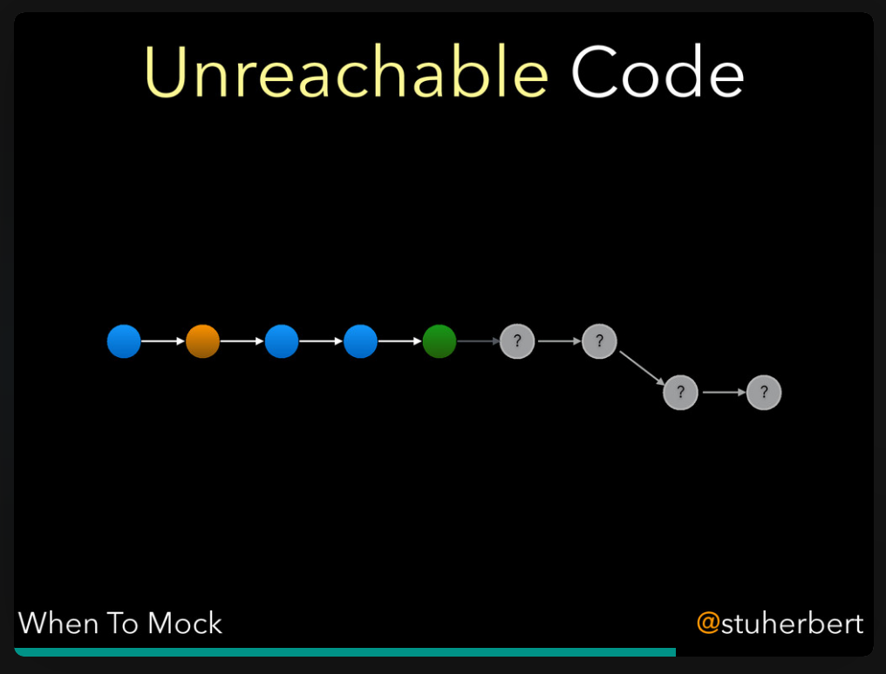

# 2.5.1 - Try Not To Mock

Priority | ID | Category | Criteria | Impacts
---------|----|----------|----------|--------
Major | [2.5.1][2.5.1] | Unit Tests | Use mocks as a last resort. | [Correctness][CORRECTNESS], [Project Maintenance][PROJECT-MAINTENANCE], [Robustness][ROBUSTNESS]

Table of Contents:
- [Description](#description)
- [Discussion](#discussion)
  - [This Prevents Us Using Mocks?](#this-prevents-us-using-mocks)
  - [Further Reading](#further-reading)

## Description

Use mocks as a last resort.

Inject _mocks_ as [mandatory dependencies][Mandatory Dependency] and/or [user-supplied optional dependencies][User-Supplied Optional Dependencies] when it's the only way to achieve code coverage.

_Mocks_ are replacements for production code. We create them, and inject them into our _unit under test_, as a means of inducing whatever behaviour our tests need.

## Discussion

### This Prevents Us Using Mocks?

No, it doesn't. It just prevents you from using _mocks_ as a substitute for writing testable code.

Some programming communities believe that every unit test should use mocks to completely isolate the _unit under test_. This _Mock First_ / _Mock Everything_ movement results in unit tests that produce _false negatives_: the unit tests pass when they should fail.

This is a serious problem for long-term project maintenance.

Over time, we rely on our unit tests to spot when a change over here breaks something over there. That change might be in our code, or in third-party code. Unit tests can't do that if everything is isolated from everything else.

On top of that, _mocks_ are only as good as your knowledge of whatever it is you are _mocking_. It's far too easy to create a _mock_ that doesn't behave the same way as the _mocked_ code. At that point, you're shipping bugs.

That's a serious problem for both correctness and robustness.

### Further Reading

Here are slides from a talk Stuart did on when to use mocks in unit testing, and why they should only be used sparingly. If you ever find the video of this talk, please let us know!

[ADOPTION]: ../../impacted-areas/ADOPTION.md
[CONTRIBUTIONS]: ../../impacted-areas/CONTRIBUTIONS.md
[CORRECTNESS]: ../../impacted-areas/CORRECTNESS.md
[GOVERNANCE]: ../../impacted-areas/GOVERNANCE.md
[PROJECT-MAINTENANCE]: ../../impacted-areas/PROJECT-MAINTENANCE.md
[ROBUSTNESS]: ../../impacted-areas/ROBUSTNESS.md
[SECURITY]: ../../impacted-areas/SECURITY.md
[TESTABILITY]: ../../impacted-areas/TESTABILITY.md
[Base Class]: ../../glossary/base-class.md
[Branded Type]: ../../glossary/branded-type.md
[Caller]: ../../glossary/caller.md
[CQRS]: ../../glossary/CQRS.md
[Data Bag]: ../../glossary/data-bag.md
[Data Guarantee]: ../../glossary/data-guarantee.md
[Data Guard]: ../../glossary/data-guard.md
[Default Value]: ../../glossary/default-value.md
[Defensive Programming]: ../../glossary/defensive-programming.md
[Dependency]: ../../glossary/dependency.md
[Dependency Injection]: ../../glossary/dependency-injection.md
[Docblock]: ../../glossary/docblock.md
[End-User]: ../../glossary/end-user.md
[Entity]: ../../glossary/entity.md
[Exported Item]: ../../glossary/exported-item.md
[Extension]: ../../glossary/extension.md
[Flavoured Type]: ../../glossary/flavoured-type.md
[Function Prefix]: ../../glossary/function-prefix.md
[Function Signature]: ../../glossary/function-signature.md
[Hard-Coded]: ../../glossary/hard-coded.md
[Identity]: ../../glossary/identity.md
[Identity Function]: ../../glossary/identity-function.md
[Identity Type]: ../../glossary/identity-type.md
[Immutability]: ../../glossary/immutability.md
[Inherited Method]: ../../glossary/inherited-method.md
[Instantiable Type]: ../../glossary/instantiable-type.md
[Mandatory Dependency]: ../../glossary/mandatory-dependency.md
[No-Op]: ../../glossary/no-op.md
[Nominal Typing]: ../../glossary/nominal-typing.md
[Optional Input]: ../../glossary/optional-input.md
[Overridden Method]: ../../glossary/overridden-method.md
[Plain Object]: ../../glossary/plain-object.md
[Primitive Type]: ../../glossary/primitive-type.md
[Protocol]: ../../glossary/protocol.md
[Refined Type]: ../../glossary/refined-type.md
[Rest Parameter]: ../../glossary/rest-parameter.md
[Reusability]: ../../glossary/reusability.md
[Side Effects]: ../../glossary/side-effects.md
[Smart Constructor]: ../../glossary/smart-constructor.md
[Structural Typing]: ../../glossary/structural-typing.md
[Type Alias]: ../../glossary/type-alias.md
[Type Casting]: ../../glossary/type-casting.md
[Type Guarantee]: ../../glossary/type-guarantee.md
[Type Guard]: ../../glossary/type-guard.md
[Type Inference]: ../../glossary/type-inference.md
[Type Predicate]: ../../glossary/type-predicate.md
[User-Supplied Functional Options]: ../../glossary/user-supplied-functional-options.md
[User-Supplied Input]: ../../glossary/user-supplied-input.md
[User-Supplied Options]: ../../glossary/user-supplied-options.md
[User-Supplied Optional Dependencies]: ../../glossary/user-supplied-optional-dependencies.md
[Value]: ../../glossary/value.md
[Value Object]: ../../glossary/value-object.md
[2.5.1]: ./2.5.1.md